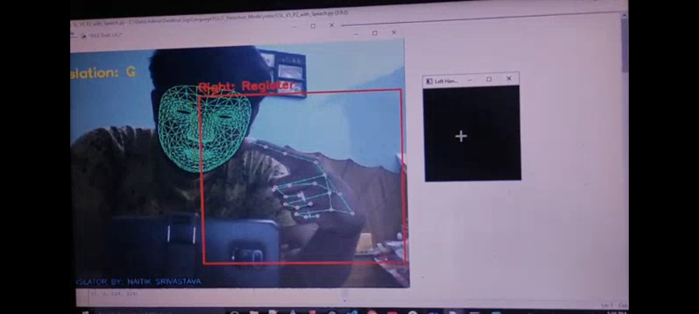
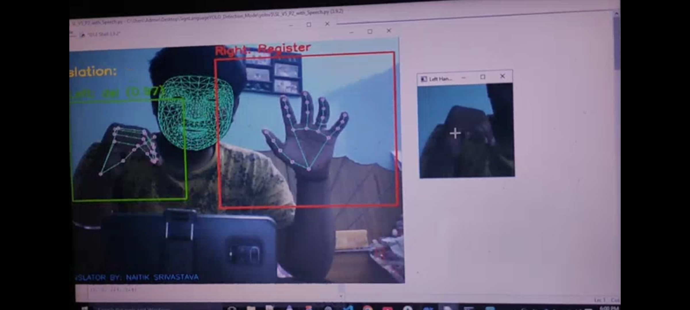

# ASL Translator using AI – Breaking the Silence

Author: Naitik Srivastava  
Department: Electronics and Communication Engineering (ECE), B.Tech  
Date of Completion: 22 July 2025

---

## 🌍 A Vision to Empower Millions

This project represents more than just technology—it’s a movement toward inclusive communication.

There are millions of individuals across the globe who are deaf or mute, and for many of them, sign language is their only voice. However, the majority of the world does not understand this language, creating an invisible wall between communities. This project tears down that wall.

With the power of real-time AI-powered gesture recognition, this ASL Translator makes it possible for deaf or mute individuals to:

- 🗣️ Communicate directly with people who don’t understand sign language.
- 👨‍👩‍👧‍👦 Express thoughts and emotions freely with family, friends, and society.
- 🏥 Seek medical help without confusion or delay.
- 🏫 Learn and participate in inclusive educational environments.
- 💼 Participate in interviews or workspaces with more confidence and independence.
- 📱 Use assistive technology that’s portable, reliable, and cost-effective.

This translator enables a person to sign with their hands, and the system instantly converts those signs into readable and audible language, creating a seamless two-way conversation. It restores the lost connection between the hearing and non-hearing worlds.

It is not just a tool; it is a symbol of empowerment, accessibility, and empathy—a step forward to ensure that no voice goes unheard**, even when it's silent.

---

## 📚 References

- Custom dataset created using 20,000+ labeled images representing ASL signs.
- Hand-tracked and labeled data includes 29 classes: A–Z, space, delete, and nothing.
- YOLOv8 used for efficient real-time gesture detection.

## 📸 Demo Previews

Here’s what the system looks like in real-time usage:

### 🔤 Live Translation View  

### ✋ Hand Gesture Detection  

---

## 🙏 Final Thoughts

This ASL Translator reflects what technology should strive to be: inclusive, compassionate, and transformative. By harnessing AI to understand human gestures, we can build a world where communication is universal—regardless of ability.

> A gesture is more than movement—it's a voice.  
> This project exists to make that voice heard.  

## 🚧 Future Work
- 🔤 Support for dynamic (moving) signs in ASL.
- 🌐 Integration with web or mobile interfaces.
- 🗣️ Add multilingual speech synthesis (e.g., Hindi, Spanish).
-  Port to microcontrollers (Raspberry Pi, ESP32-CAM).
-  Improve accuracy using Transformer-based models.

More Updates coming in this Git Repo.

Together, let’s ensure that everyone is heard.

---

© 2025 Naitik Srivastava. All rights reserved.

## 📬 Contact
For questions, collaborations, or suggestions:  
**Naitik Srivastava**  
📧 Email: [naitiksrivastava123fzd@gmail.com] 
   LinkedIn:  [https://www.linkedin.com/in/naitik-srivastava-6890b0321?utm_source=share&utm_campaign=share_via&utm_content=profile&utm_medium=android_app]

📍 Department of Electronics and Communication Engineering (ECE), B.Tech
